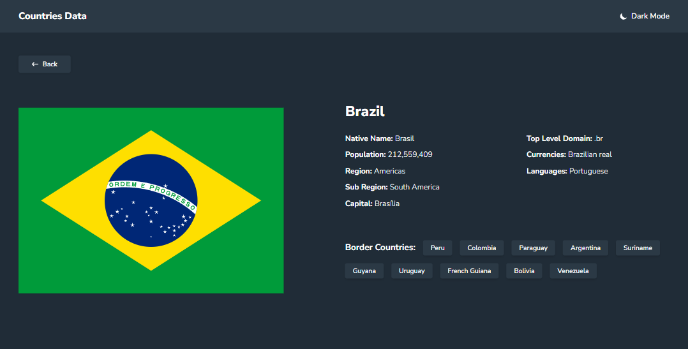
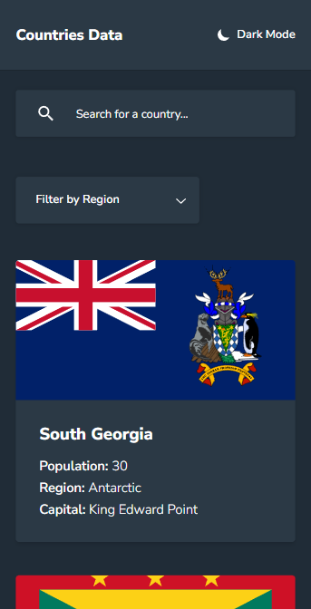
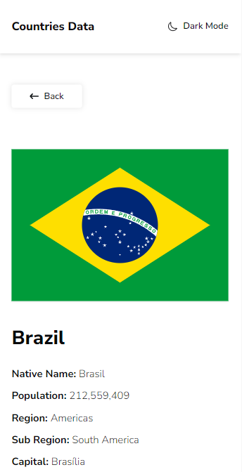

[TYPESCRIPT__BADGE]: https://img.shields.io/badge/typescript-D4FAFF?style=for-the-badge&logo=typescript
[REACT__BADGE]: https://img.shields.io/badge/React-005CFE?style=for-the-badge&logo=react
[REACT_ROUTER__BADGE]: https://img.shields.io/badge/React_Router-CA4245?style=for-the-badge&logo=react-router&logoColor=white
[REACT_QUERY__BADGE]: https://img.shields.io/badge/React_Query-FF4154?style=for-the-badge&logo=ReactQuery&logoColor=white
[TAILWIND_CSS__BADGE]: https://img.shields.io/badge/tailwindcss-%2338B2AC.svg?style=for-the-badge&logo=tailwind-css&logoColor=white
[SHADCN_UI__BADGE]: https://img.shields.io/badge/shadcn%2Fui-000000?style=for-the-badge&logo=shadcnui&logoColor=white
[PROJECT__BADGE]: https://img.shields.io/badge/📱Acessar_o_projeto-000?style=for-the-badge&logo=project
[PROJECT__URL]: https://countries-data-zeta.vercel.app/

<h1 align="center" style="font-weight: bold;">Countries Data 🌎</h1>

![react][REACT__BADGE]
![typescript][TYPESCRIPT__BADGE]
![react-router][REACT_ROUTER__BADGE]
![react-query][REACT_QUERY__BADGE]
![tailwind-css][TAILWIND_CSS__BADGE]
![shadcn-ui][SHADCN_UI__BADGE]

    <a href="#sobre">Sobre</a> • 
    <a href="#tecnologias">Tecnologias utilizadas</a> • 
    <a href="#rotas">Rotas do projeto</a>

    
    

    
    

<h2 id="sobre">📌 Sobre</h2>

Countries Data é um projeto que consulta a API pública: [REST Countries](https://restcountries.com/#api-endpoints-using-this-project), essa API disponibiliza informações e dados estatísticos sobre os países do mundo.

A função do projeto é listar os países contidos na API, cada país possui um card na página inicial e ao clicar no card uma página dinâmica é aberta. O projeto possui duas opções de filtro para realizar uma busca mais acertiva: por nome do país e por continente, esses dois tipos de filtros ainda podem ser utilizados em conjunto.

Esse projeto ainda duas opções de temas: light e dark.

O template desse projeto pode ser encontrado em: [template-countries-data](https://www.frontendmentor.io/challenges/rest-countries-api-with-color-theme-switcher-5cacc469fec04111f7b848ca)

[![project][PROJECT__BADGE]][PROJECT__URL]

<h2 id="tecnologias">🛠️ Tecnologias Utilizadas</h2>

- **TypeScript** - Linguagem de programação baseada em JavaScript, com a adição de tipagem estática

- **React** - Biblioteca front-end para construir interfaces visuais com JavaScript

- **React Router** - Pacote utilizado para adicionar e acessar rotas na aplicação

- **React Query** - Ferramenta para gerenciar e manipular requisições assíncronas

- **Shadcn/ui** - Coleção de componentes reutilizáveis

- **TailwindCSS** - Framework de CSS

<h2 id="rotas">📍 Rotas da Aplicação</h2>

| Rota                     | Descrição                  |
| ------------------------ | -------------------------- |
| <kbd>/</kbd>             | página inicial             |
| <kbd>/contry/:name</kbd> | página dinâmica de um país |
